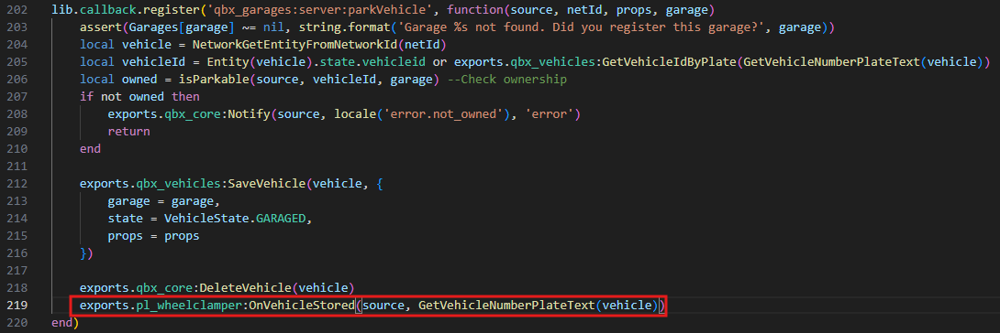

# Installation



### Step 1 — Install Dependencies

Add the following to your `server.cfg`:

```
ensure ox_lib
ensure pl_wheelclamper
```



### Step 2 — Add Items

Open one of the following files from the `Install/` folder depending on your inventory:

| Inventory     | File to open             |
| ------------- | ------------------------ |
| ox\_inventory | `items_ox_inventory.lua` |
| QBCore        | `items_qb_inventory.lua` |

Copy its contents into your inventory item configuration:

| Inventory     | Destination file              |
| ------------- | ----------------------------- |
| QBCore        | `qb-core/shared/items.lua`    |
| ox\_inventory | `ox_inventory/data/items.lua` |



### Step 3 — Add Inventory Images

Open the folder:

```
Install/Img
```

Copy all images into your inventory's image directory:

| Inventory     | Destination directory       |
| ------------- | --------------------------- |
| QBCore        | `qb-inventory/html/images/` |
| ox\_inventory | `ox_inventory/web/images/`  |



### Step 4 — Garage Compatibility

To show the wheel clamp visual when a clamped vehicle is spawned from a garage, add one export call inside your garage resource.

> This step is only required if you use a garage script.

#### esx\_garage

**File:** `esx_garage/server/main.lua` — Line \~23\
**Event:** `esx_garage:updateOwnedVehicle`

Add inside the event handler:

```lua
exports.pl_wheelclamper:OnVehicleSpawned(source, data.vehicleProps.plate)
exports.pl_wheelclamper:OnVehicleStored(source, data.vehicleProps.plate)
```

#### Before

<figure><figcaption></figcaption></figure>

#### After

<figure><figcaption></figcaption></figure>

#### qb-garages

**File:** `qb-garages/server/main.lua` — Line \~124 & 145\
**Callback:** `qb-garages:server:spawnvehicle, qb-garages:server:canDeposit`

Add at the end of the event handler:

```lua
exports.pl_wheelclamper:OnVehicleSpawned(source, plate)
exports.pl_wheelclamper:OnVehicleStored(source, plate)
```

#### Before

<figure><figcaption></figcaption></figure>

<figure><figcaption></figcaption></figure>

#### After

<figure><figcaption></figcaption></figure>

<figure><figcaption></figcaption></figure>

#### qbx\_garage

**File:** `qbx_garage/server/spawn-vehicle.lua` **- Line 32 ,** `qbx_garage/server/main.lua` **- Line 202**

**Callback:** `qbx_garages:server:spawnVehicle, qbx_garages:server:parkVehicle`

Add before the `return` at the end of the callback:

```lua
exports.pl_wheelclamper:OnVehicleSpawned(source, playerVehicle.props.plate)
exports.pl_wheelclamper:OnVehicleStored(source, GetVehicleNumberPlateText(vehicle))
```

#### Before

<figure><figcaption></figcaption></figure>

<figure><figcaption></figcaption></figure>

#### After

<figure><figcaption></figcaption></figure>

<figure><figcaption></figcaption></figure>

#### JG Advanced Garages

**File:** `jg-advancedgarages->config-config-cl.lua` , `jg-advancedgarages->config-config-sv.lua`

**Event:** `jg-advancedgarages:client:InsertVehicle:config`  ,  `jg-advancedgarages:client:TakeOutVehicle:config`

**Modify both events like below**

```lua
---@param vehicle integer Vehicle entity
---@param vehicleDbData table Vehicle row from the database
---@param type "personal" | "job" | "gang"
RegisterNetEvent("jg-advancedgarages:client:InsertVehicle:config", function(vehicle, vehicleDbData, type)
  -- Code placed in here will be run when the player inserts their vehicle (if the vehicle is owned; and passes all the checks)
  TriggerServerEvent("jg-advancedgarages:server:wheelclamper:vehicleStored", vehicleDbData.plate)
end)

---@param vehicle integer Vehicle entity
---@param vehicleDbData table Vehicle row from the database
---@param type "personal" | "job" | "gang"
RegisterNetEvent("jg-advancedgarages:client:TakeOutVehicle:config", function(vehicle, vehicleDbData, type)
  -- Code placed in here will be run after a vehicle has been taken out of a garage
  TriggerServerEvent("jg-advancedgarages:server:wheelclamper:vehicleSpawned", vehicleDbData.plate)
end)

```

**Paste the code in the file jg-advancegarages->config-config-sv.lua**

```lua
-- Add your own server code in here for custom functionality

RegisterNetEvent("jg-advancedgarages:server:wheelclamper:vehicleStored", function(plate)
  local source = source

  exports.pl_wheelclamper:OnVehicleStored(source, plate)
end)

RegisterNetEvent("jg-advancedgarages:server:wheelclamper:vehicleSpawned", function(plate)
  local source = source

  exports.pl_wheelclamper:OnVehicleSpawned(source, plate)
end)

```


